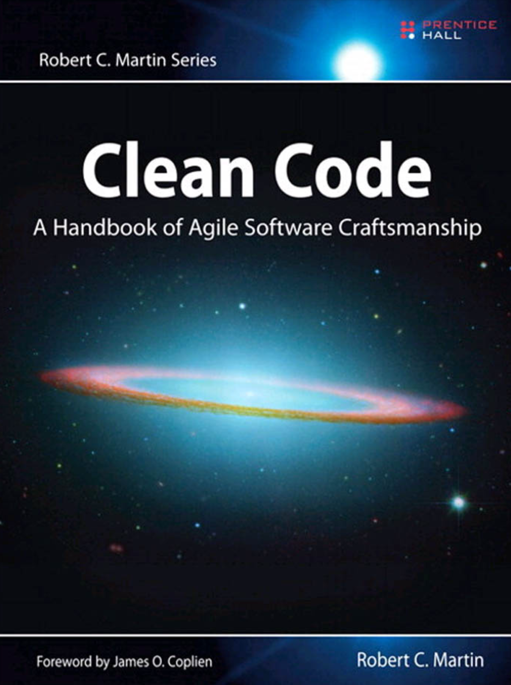

# Clean Code Notes



After graduating with my degree in computer engineering, I decided it was time to deepen my software development skills. This book had been on my mind for ages, so I finally committed to finishing it. As I read, I took small notes both to reinforce what I learned and to help anyone else who might find these summaries useful :))

## Notes Structure

```
clean-code-notes/
├── chapter01/
├── chapter02/
├── chapter03/
├── chapter04/
├── chapter05/
├── chapter06/
├── chapter07/
├── chapter08/
├── chapter09/
├── chapter10/
├── chapter11/
├── chapter12/
├── chapter13/
├── chapter14/
├── chapter15/
├── chapter16/
└── chapter17/
```

## Key Topics Covered

### Core Principles

- **Meaningful Names**: How to choose clear, descriptive names
- **Functions**: Writing small, focused functions
- **Comments**: When and how to write effective comments
- **Formatting**: Code formatting and style guidelines
- **Error Handling**: Proper exception handling strategies

### The Boy Scout Rule

> "Leave the campground cleaner than you found it."

Always leave code better than you found it, even if it's just a small improvement.
