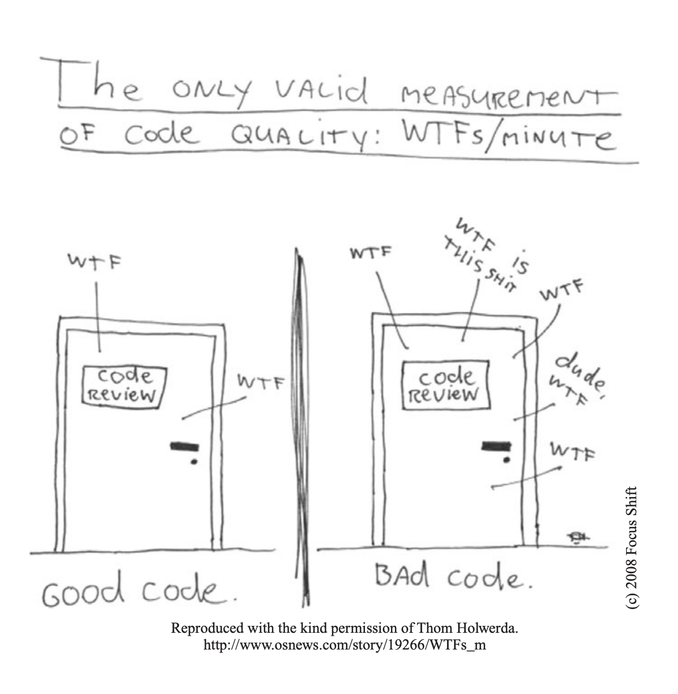

### 5S Philosophy:

- **Seiri**: organization, knowing where things are.
- **Seiton**: tidiness, a place for everything, and everything in its place
- **Seiso**: shine, dont comment??
- **Seiketsu**: standardization, group agrees about how to keep the workplace clean
- **Shutsuke**: discipline, discipline to follow the practices and to frequently reflect on one’s work and be willing to change

